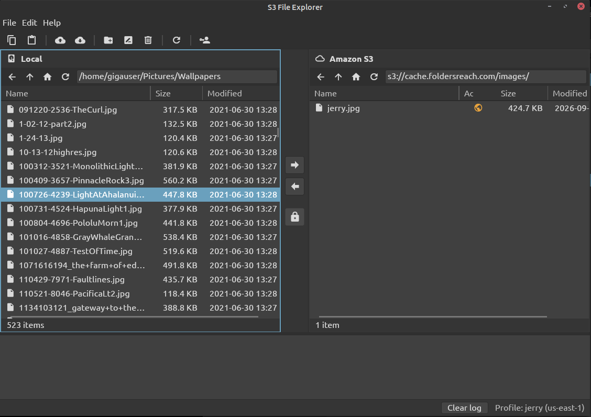

# S3 File Explorer

A two-pane desktop file manager for Amazon S3. Your local files are on one side and your S3 buckets on the other; copy between them with the arrow buttons, drag and drop, or copy and paste.

Built with .NET 8 and [Avalonia](https://avaloniaui.net/), so it runs on Linux, Windows and macOS.



## Features

- **Two panes**: local files and S3 side by side, with sortable, resizable columns. The sides can be swapped in Preferences.
- **Transfers both ways**: upload and download files and whole folders, several at a time, by button, drag and drop (including from your file manager), or Ctrl+C / Ctrl+V. Progress, cancel, and a choice to overwrite or skip files that already exist.
- **Activity log**: every transfer and change is recorded with a timestamp at the bottom of the window.
- **AWS profiles**: keep several sets of AWS keys under friendly names and switch between them from File > Profiles. They are stored encrypted (AES-256-GCM).
- **File management**: new folder, rename and delete in either pane; create and delete buckets (deleting asks you to type the bucket name first).
- **Public or private**: an Access column shows whether each S3 file is public. Upload as private or public with the lock button, change existing files with Public / Private, and let a bucket allow public files when its settings block them.
- **Sharing links**:
  - **Copy URL** copies a file's permanent link, using the bucket's CloudFront address (found automatically) when there is one.
  - **Temporary Link** creates a link to a private file that expires after the time you choose (up to 7 days).
  - Double-clicking a public file opens it in your browser.
- **Look and feel**: a dark theme modelled on Linux Mint (Mint-Y-Dark), the Ubuntu font, and Material Design icons.

## Requirements

- [.NET 8 SDK](https://dotnet.microsoft.com/download/dotnet/8.0) (8.0.100 or later)
- An AWS account and an access key (access key ID and secret access key)

NuGet packages (Avalonia, the AWS SDK for S3 and CloudFront) are downloaded automatically on the first build.

### Linux

Install the .NET 8 SDK with your distribution's package manager or Microsoft's instructions, for example on Ubuntu / Linux Mint:

```sh
sudo apt install dotnet-sdk-8.0
```

Avalonia needs an X11 desktop (or XWayland) and fontconfig, which desktop installs already have.

### Windows

Install the .NET 8 SDK from the link above, or:

```powershell
winget install Microsoft.DotNet.SDK.8
```

### macOS

Install the .NET 8 SDK from the link above, or:

```sh
brew install --cask dotnet-sdk
```

## Build and run

The commands are the same on every platform:

```sh
git clone https://github.com/sysrpl/filestore.git
cd filestore
dotnet build
dotnet run
```

### Stand-alone builds

To make a self-contained program that runs without .NET installed, publish for the target platform (`-r` is the [runtime identifier](https://learn.microsoft.com/dotnet/core/rid-catalog)):

```sh
# Linux (x64)
dotnet publish -c Release -r linux-x64 --self-contained -o publish/linux-x64

# Windows (x64)
dotnet publish -c Release -r win-x64 --self-contained -o publish/win-x64

# macOS (Apple silicon / Intel)
dotnet publish -c Release -r osx-arm64 --self-contained -o publish/osx-arm64
dotnet publish -c Release -r osx-x64 --self-contained -o publish/osx-x64
```

Run `filestore` (or `filestore.exe` on Windows) from the output folder. The version shown in Help > About comes from `<Version>` in `filestore.csproj`.

## First run

1. The **AWS Profiles** dialog opens. Enter a friendly name, your access key ID, secret access key, and a default region, then **Save**.
2. The S3 pane lists your buckets. Open a bucket and a local folder, select files, and press the arrow between the panes (or drag them across).

Add more profiles, or switch between them, from **File > Profiles**. Preferences are under **Edit > Preferences**.

## AWS permissions

Browsing and transfers need the usual S3 permissions (`s3:ListAllMyBuckets`, `s3:ListBucket`, `s3:GetObject`, `s3:PutObject`, `s3:DeleteObject`, `s3:GetBucketLocation`). Some features need more:

| Feature | Permissions |
| --- | --- |
| Access column | `s3:GetObjectAcl`, `s3:GetBucketPolicyStatus`, `s3:GetBucketPublicAccessBlock`, `s3:GetBucketOwnershipControls` |
| Public / Private | `s3:PutObjectAcl`, and to allow public files in a bucket `s3:PutBucketOwnershipControls`, `s3:PutBucketPublicAccessBlock` |
| CloudFront links | `cloudfront:ListDistributions` |
| New / delete bucket | `s3:CreateBucket`, `s3:DeleteBucket`, `s3:ListBucketVersions`, `s3:DeleteObjectVersion` |

If a permission is missing, that feature says so in the activity log and the rest of the app keeps working.

Making files public with ACLs also depends on S3 **Block Public Access**. The app can change the bucket's setting for you, but not the account-wide one (S3 console > *Block Public Access settings for this account*).

## Where things are stored

Everything is kept in your user's app data folder:

| Platform | Folder |
| --- | --- |
| Linux | `~/.config/filestore/` |
| Windows | `%APPDATA%\filestore\` |
| macOS | `~/Library/Application Support/filestore/` |

- `profiles.dat`: your AWS profiles, encrypted with AES-256-GCM.
- `profiles.key`: the random key for `profiles.dat`, readable only by your user on Linux and macOS. Anyone who can read both files can decrypt your keys, so keep that folder private.
- `settings.json`: preferences (nothing secret).

## Project layout

```
filestore.csproj        project file (packages, version)
src/
  Program.cs, App.axaml   startup, theme and fonts
  Models/                 BrowserItem, Profile, LogEntry
  Services/               S3 and local file access, transfers, CloudFront lookup,
                          encrypted profile storage, settings
  Views/                  main window, panes and dialogs
  Themes/MintDark.axaml   the dark theme
  Helpers/                icons, tooltips, build information
resources/              Ubuntu fonts, Material Design Icons font
images/                 screenshots for this README
```

## Credits

- [Avalonia UI](https://avaloniaui.net/) (MIT)
- [AWS SDK for .NET](https://github.com/aws/aws-sdk-net) (Apache 2.0)
- [Material Design Icons](https://pictogrammers.com/library/mdi/) (Apache 2.0)
- [Ubuntu font family](https://design.ubuntu.com/font) (Ubuntu Font Licence 1.0)

## License

MIT; see [LICENSE](LICENSE).
